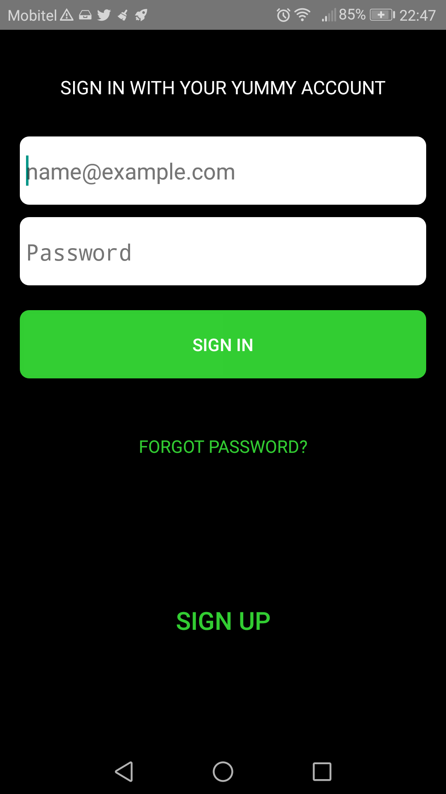
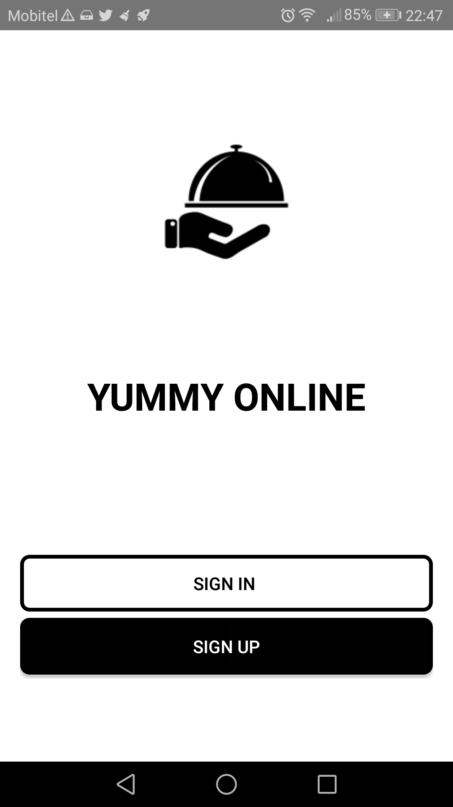

<html>
<head>

</head>
<body>
<h1>Yumy Online Food Seraching System</h1>
<h2>What is this repository for?</h2>

<ul>
  <li>This repository is for Yummy Online-Android</li>
  <li>Technologies: - Android, SQLite, AsyncTask, JSON, Google Maps, Gmail, APIs[POST & GET],GPS, Location Services </li>
  <li>Group Titans-FIT UOM</li>
   <li>Mentored By Virtusa Pvt. Ltd</li>
    <li>Version 1.0</li>
</ul>  

 

 

</body>
